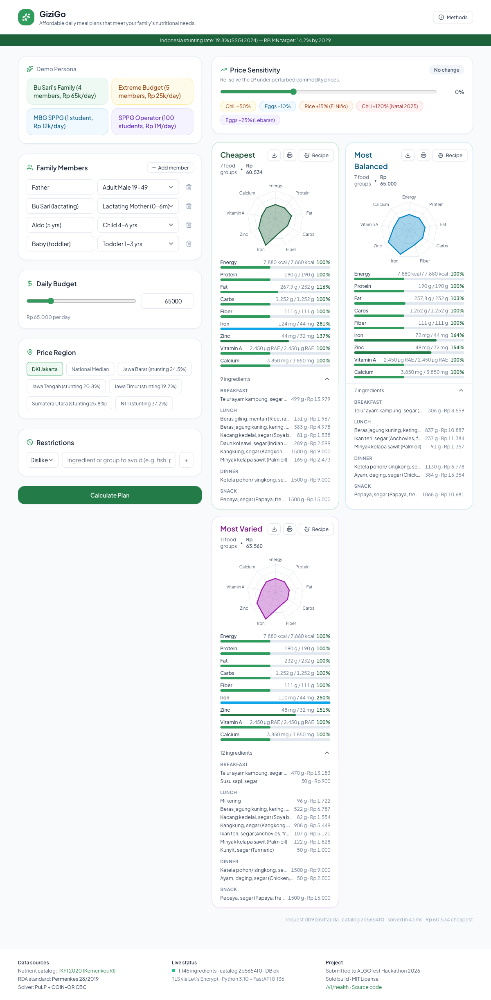
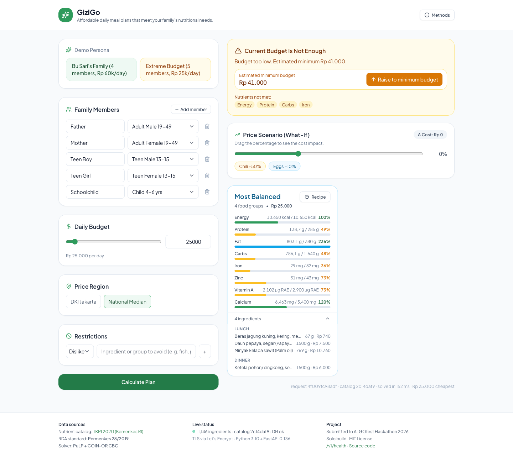

# GiziGo

> **Operations-research-grade meal planner against Indonesian childhood stunting.**
> Submitted to ALGOfest Hackathon 2026 (Battle of the Beasts).
>
> 🌐 Live demo: **https://gizigo.jmola.my.id**



GiziGo turns every Rupiah of household food budget into the *most nutritious* daily meal plan it can buy. The user enters the family composition (toddlers, school children, lactating mothers, etc.), a daily budget, region, and any dietary restrictions. In under a second the service returns three optimal plans (Cheapest / Most Balanced / Most Varied), each with a per-nutrient AKG achievement bar, a sensitivity-analysis slider, and an infeasibility coach when the budget cannot meet the family's nutritional minimums.

The work is grounded in two government data sources:

- **Tabel Komposisi Pangan Indonesia 2020** (Direktorat Gizi Masyarakat, Kemenkes RI) — 1,146 ingredients with nine tracked nutrients each (energy, protein, fat, carbohydrate, **fiber**, iron, zinc, vitamin A, calcium).
- **Permenkes 28/2019** — the Angka Kecukupan Gizi standard for seven AKG categories that cover both demo personas.

## Why this matters

Indonesia's under-five stunting rate is **19.8% (SSGI 2024)** while the RPJMN 2024-2029 target is 14 %. Stunting is rooted in the first 1,000 days of life, where the limiting factor is most often *cost-feasible nutrition*, not knowledge. GiziGo attacks that gap directly: it answers *"given my budget today, what is the most nutritious mix of cheap local foods I can buy?"* — and tells the user exactly when the budget falls short and by how much.

## What's inside

```
              ┌──────────────────────────────────────────────────┐
              │  apps/web (Vite + React + Tailwind)              │
              │   • HouseholdForm + persona menu                 │
              │   • PlanCard with 8 AKG achievement bars         │
              │   • SensitivityBar (debounced re-solve)          │
              │   • InfeasibilityPanel + RecipeDrawer            │
              └──────────────────┬───────────────────────────────┘
                                 │ HTTPS, JSON, CORS
              ┌──────────────────▼───────────────────────────────┐
              │  services/api (FastAPI on uvicorn)               │
              │   • /v1/optimize  – ILP solve (PuLP + CBC)       │
              │   • /v1/sensitivity – full re-solve under price  │
              │     perturbations (~120 ms typical)              │
              │   • /v1/humanize   – templated meal narration    │
              │   • /v1/health     – catalog + DB liveness       │
              └──────────────────┬───────────────────────────────┘
                                 │ asyncpg
              ┌──────────────────▼───────────────────────────────┐
              │  Postgres 16 (plan caching, idempotent on hash)  │
              └──────────────────────────────────────────────────┘
```

The optimizer is a **deterministic linear program**, not a chatbot. We chose the ILP route because the problem itself is mathematically clean: minimize cost subject to AKG floor constraints, a budget cap, hard exclusions for restrictions, and per-ingredient gram caps. Three plans are produced from this base:

| Plan | Objective | Method |
|---|---|---|
| **Cheapest** | `min Σ price·grams` | Pure cost LP |
| **Most Balanced** | `min Σ (price·grams) + α · max_n overshoot_n` | LP with over-shoot variables capped at 1.3 × RDA per nutrient |
| **Most Varied** | `max Σ binary food_group_present` | MIP with binary group-presence indicators, ≤ 1.05× cheapest cost |

When no feasible solution exists at the user's budget, GiziGo runs a **bisection search on the budget** to estimate the *minimum feasible budget*, then reports the deficit nutrients and offers a one-click "raise to minimum" action — turning a frustrating "no answer" into actionable guidance.



A full system architecture diagram lives at [`docs/architecture.svg`](docs/architecture.svg).

A full mathematical formulation lives in [`docs/ilp-formulation.md`](docs/ilp-formulation.md). Sensitivity analysis is implemented as full re-solves rather than dual variables, which keeps the code small and the latency under 500 ms while still being honest about how prices and AKGs interact.

## Submitted under

| Track | How GiziGo fits |
|---|---|
| **Best HealthTech Project** | Direct attack on stunting via personalized AKG planning grounded in Permenkes 28/2019. Provides an audit layer for the *Makan Bergizi Gratis* (MBG) program. |
| **Best Social Impact** | Targets a 19.8% national stunting rate; UI in English with three demo personas anchored in real Indonesian household and program-operator profiles |
| **Top 3 Grand** | Operations-research depth (ILP + sensitivity + bisection) plus a polished, end-to-end live deployment with concrete policy relevance to a Rp 71-trillion national program |

## Two demo personas + one policy use-case

1. **Bu Sari's Family** — father (19-49), Bu Sari (lactating mother), child 5 yrs, toddler. Rp 60,000/day, region DKI Jakarta. Optimizer returns ~Rp 35,000 across 5+ food groups, all eight AKG nutrients ≥ 100 %.
2. **Extreme Budget** — 5-member household, region National Median, Rp 25,000/day. Optimizer returns *infeasible*, surfaces the minimum estimated budget at Rp 41,000-63,000 (depending on persona shape), and lists the deficit nutrients (energy, protein, vitamin A, calcium).
3. **MBG SPPG** — one primary-school student, Rp 12,000/day, region National Median. Models the per-portion budget of *Makan Bergizi Gratis* (Free Nutritious Meals), Indonesia's flagship Rp 71-trillion school-meal program launched January 2025 under Perpres 83/2024.

All three personas are baked into the UI as one-click chips so the judge can reproduce them in 2 seconds. They also have **deep-link URLs** that auto-load and auto-calculate:

- https://gizigo.jmola.my.id/?persona=bu_sari
- https://gizigo.jmola.my.id/?persona=anggaran_ekstrem
- https://gizigo.jmola.my.id/?persona=mbg_sppg

## Policy implication: Makan Bergizi Gratis (MBG)

The MBG program targets ~82.9 million beneficiaries by 2029 with a per-portion budget reported in the press at **Rp 10,000-15,000**. Public debate has questioned whether that envelope is sufficient to meet a child's daily nutritional needs.

GiziGo answers that question quantitatively. For a single primary-school child (`child_4_6` AKG category) using national-median prices, the optimizer reports:

| Plan | Cost | Food groups | Notes |
|---|---|---|---|
| Cheapest | **Rp 9,472** | 5 | Pure cost LP. AKG met, iron 200%+ from concentration on cheap protein |
| Most Balanced | **Rp 10,827** | 5 | Penalises nutrient over-shoot beyond 130% RDA — flatter achievement profile |
| Most Varied | **Rp 9,945** | **6** | MIP that maximises distinct food groups within +5% cost headroom |

**The headline finding**: the MBG per-portion budget of Rp 10-12k has only ~Rp 500-3,000 of headroom over the optimizer-derived AKG floor of Rp 9,472 for primary-age children. That is much narrower than press estimates and matches the public concern that the budget is *just* sufficient when procurement is optimized — and infeasible otherwise.

For Bu Sari's family at Rp 65k/day, the same three-plan output produces *visibly different* meals: Cheapest Rp 60,534 / 7 groups / 9 ingredients, Most Balanced Rp 65,000 / 7 groups / 7 ingredients (over-shoot smoothed), Most Varied Rp 63,560 / **11 groups, 12 ingredients**. Each plan card surfaces a 9-bar AKG achievement strip — including **fiber**, an under-tracked nutrient that the program-level MBG KPI itself does not surface. The AKG floor was bumped from Rp 60k to Rp 65k after fiber was added: at Rp 60k the LP became infeasible by Rp 533, exactly the kind of constraint a chatbot would not catch.

GiziGo can therefore serve SPPG (*Satuan Pelayanan Pemenuhan Gizi*, the program's local kitchen units) as a deterministic audit and procurement-planning layer:

- Plug in the actual local prices each SPPG faces and verify that the menu they propose meets AKG.
- Plug in the budget envelope and let the optimizer return the cheapest AKG-compliant ingredient mix.
- Use the sensitivity slider to plan against price shocks (chili, eggs, beef) before they hit operations.

This is not an attack on the program. It's the audit layer the program needs.

Each plan card has a **print button** that renders a single-page A4 PDF of just that plan (header, AKG bars, full ingredient list grouped by meal slot) using the browser's built-in print engine — useful for handing to a community-health worker, a teacher, or printing as an SPPG kitchen-prep sheet.

## Technologies used

- **Backend**: Python 3.10+, FastAPI 0.136, PuLP 3.3 (CBC), Pydantic v2, asyncpg, BeautifulSoup4
- **Frontend**: Vite 8, React 18, Tailwind 3, Recharts, Zod, Sonner, Lucide
- **Data**: Postgres 16 (plan cache, JSONB), one-shot scrape of panganku.org committed under `data/raw/panganku/`
- **Infra**: Ubuntu 22.04 VPS, Docker, nginx, Let's Encrypt via certbot, systemd

## Reproducibility

```bash
make bootstrap       # creates Python venv, installs web deps, starts local Postgres
make data            # idempotent scrape + normalize (1146 ingredients, 0 errors)
make api-dev         # starts FastAPI on :8001 (with --reload)
make web-dev         # starts Vite on :5173
make test            # pytest unit tests
make deploy          # rsync + remote bootstrap (uses SSH alias `vpsgw`)
```

Every dataset is committed to the repo so the build is reproducible without re-hitting upstream sources. See [`data/MANIFEST.md`](data/MANIFEST.md) for the full provenance.

## Repository layout

```
.
├── services/api/          FastAPI service (Python 3.10)
│   ├── src/               models, optimizer, humanizer, main
│   ├── scripts/           one-shot scrape + normalize
│   └── tests/
├── apps/web/              Vite React app
├── data/
│   ├── raw/panganku/      ~1146 raw HTML detail pages, committed
│   ├── normalized/        ingredients.json, food_groups.json
│   ├── akg/               permenkes-28-2019.json (14 AKG categories × 9 nutrients)
│   ├── prices/            dki_jakarta.yaml + national_baseline.yaml
│   ├── substitutes.yaml
│   └── cooking-method.yaml
├── docs/
│   ├── ilp-formulation.md
│   ├── data-sources.md
│   └── demo-script.md
├── openspec/changes/gizigo-meal-optimizer/  full spec-driven design trail
├── scripts/               deploy.sh, docker-postgres.sh, nginx + systemd templates
└── Makefile
```

## Limitations and honest disclosure

- The price tables are a **manually curated 105-ingredient subset** sampled May 2026 from infopangan.jakarta.go.id and PIHPS Bank Indonesia. The optimizer would scale to the full 1,146-ingredient catalog as soon as more prices are filled in.
- The cooking-method humanizer is **template-driven** by default. An optional LLM path exists behind the `HUMANIZER_LLM_ENABLED` flag with a post-render validator that re-extracts ingredient grams; if drift > 5 %, the LLM output is discarded and the templated path is used. The default is off so the demo stays deterministic.
- The "Most Varied" plan is a deterministic iterative-substitution heuristic on top of "Cheapest", not a separate ILP. When the variety target cannot be reached without violating AKG or budget, the plan is flagged with a `diverse_constraint_relaxed` badge and the reason is shown to the user.

## Credits

- TKPI 2020: ISBN 978-623-301-0368 — Kemenkes RI, retrieved via panganku.org.
- Permenkes 28/2019: Peraturan Menteri Kesehatan RI No. 28 Tahun 2019.
- Solver: COIN-OR CBC (Eclipse Public License) via PuLP (MIT).
- All code original to this hackathon.

## License

MIT. See [LICENSE](LICENSE).
